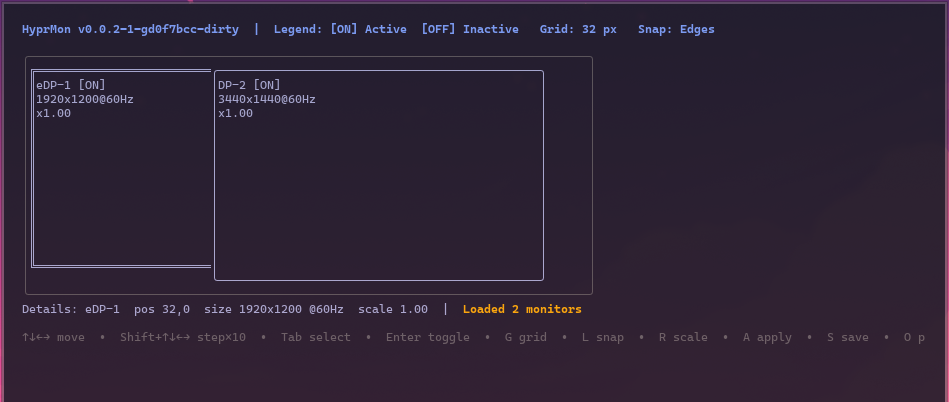
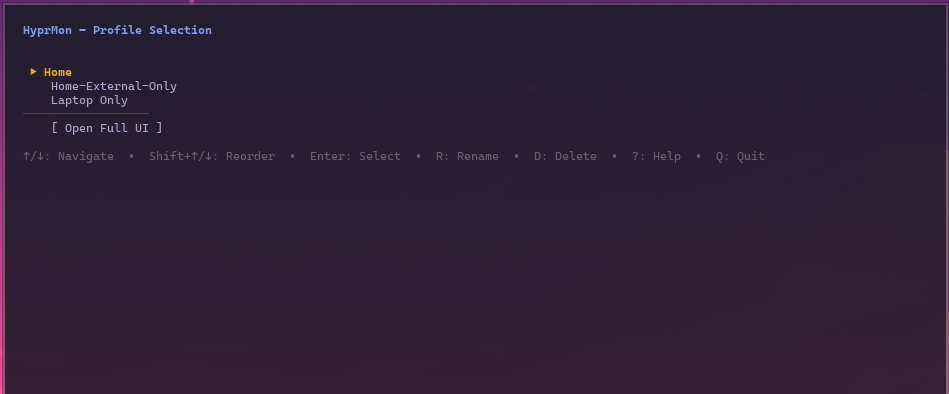

# HyprMon

HyprMon is a TUI (Terminal User Interface) tool for configuring monitors on Arch Linux running Wayland with Hyprland. It provides a visual "desk map" where you can arrange monitors using keyboard and mouse controls, with real-time application to Hyprland.

## Features

- **Visual Monitor Layout**: See all your monitors as proportional boxes in a spatial map
- **Keyboard & Mouse Control**: Move monitors with arrow keys or drag them with your mouse
- **Smart Snapping**: Automatic edge and center alignment with visual guides
- **Grid Movement**: Configurable grid sizes (1, 8, 16, 32, 64 pixels)
- **Scale Selection**: Interactive menu with common DPI scaling values (0.5x to 3.0x)
- **Resolution & Refresh Rate**: Choose from all available display modes (1080p@144Hz, 4K@60Hz, etc.)
- **Advanced Display Settings**: Color depth (8/10-bit), color management (sRGB/Wide/HDR), VRR, rotation/transform
- **HDR Support**: HDR color mode with SDR brightness and saturation controls
- **Visual Indicators**: Monitor boxes show HDR, 10-bit, VRR, and transform status
- **Live Apply**: Instantly apply changes to Hyprland or save them to configuration
- **Safe Rollback**: Revert to previous configuration if something goes wrong
- **Automatic Backups**: Creates timestamped backups before modifying config files
- **Monitor Profiles**: Save and restore different monitor configurations

## Screenshots





## Installation

### via AUR

`yay -S hyprmon-bin`

### From source

#### Prerequisites

- Go 1.20 or higher
- Hyprland window manager
- `hyprctl` command available
- Optional: `wlr-randr` for additional monitor detection

#### Build from Source

```bash
git clone https://github.com/erans/hyprmon.git
cd hyprmon
go build -o hyprmon
sudo mv hyprmon /usr/local/bin/
```

## Usage

### Main UI
```bash
hyprmon
```

### Profile Management
```bash
# Apply a saved profile directly
hyprmon --profile work

# Show profile selection menu
hyprmon profiles
```

### Keyboard Controls (Main UI)

| Key | Action |
|-----|--------|
| `↑↓←→` or `hjkl` | Move selected monitor by grid size |
| `Shift+↑↓←→` | Move by 10× grid size |
| `Tab` / `Shift+Tab` | Cycle through monitors |
| `G` | Change grid size (1, 8, 16, 32, 64 px) |
| `L` | Toggle snap mode (Off, Edges, Centers, Both) |
| `R` | Open scale selector with common DPI values |
| `F` | Open resolution & refresh rate mode picker |
| `[` / `]` | Decrease/Increase scale by 0.05 |
| `Enter` or `Space` | Toggle monitor active/inactive |
| `C` or `D` | Open advanced display settings dialog |
| `A` | Apply changes live to Hyprland |
| `S` | Save changes to configuration file |
| `P` | Save current layout as named profile |
| `Z` | Revert to previous configuration |
| `Q` or `Ctrl+C` | Quit |

### Mouse Controls

| Action | Effect |
|--------|--------|
| Left Click | Select monitor |
| Left Drag | Move monitor (with snapping) |
| Right Click | Toggle monitor active/inactive |
| Scroll Wheel | Adjust monitor scale |

### Visual Indicators

- **Green boxes**: Active monitors
- **Gray boxes**: Inactive monitors
- **Double border**: Currently selected monitor
- **Alignment guides**: Appear when monitors align
- **Status badges**: HDR, 10-bit, VRR, and rotation indicators on monitor boxes

## Advanced Display Settings

Press `C` or `D` in the main UI to open the advanced display settings dialog for the selected monitor. This allows you to configure:

### Color Settings
- **Color Depth**: Switch between 8-bit and 10-bit color depth
- **Color Mode**: Choose from Auto, sRGB, Wide, HDR, or HDR-EDID color management
- **SDR Controls**: When in HDR mode, adjust SDR brightness (0.5-2.0) and saturation (0.5-1.5)

### Display Features  
- **VRR (Variable Refresh Rate)**: Configure VRR mode as Off, On, or Fullscreen-only
- **Transform**: Set monitor rotation (Normal, 90°, 180°, 270°) or flipping

### Advanced Dialog Controls
| Key | Action |
|-----|--------|
| `Tab` / `↑↓` | Navigate between settings |
| `Space` | Toggle boolean settings |
| `←→` | Adjust slider values (SDR brightness/saturation) |
| `Enter` | Apply changes and close dialog |
| `Esc` | Cancel changes and close dialog |

## Profiles

HyprMon supports saving and loading monitor configurations as profiles, perfect for different setups like home, work, or presentation modes.

### Creating Profiles
- In the main UI, press `P` to save the current layout
- Enter a descriptive name (e.g., "home", "work", "laptop")
- Confirm overwrite if a profile with that name exists
- Profiles are stored in `~/.config/hyprmon/profiles/`

### Using Profiles
```bash
# Quick switch via command line (perfect for keybindings)
hyprmon --profile home
hyprmon --profile work
hyprmon --profile laptop-only

# Interactive profile menu - shows all saved profiles
hyprmon profiles
```

The profile menu allows you to:
- Select and apply any saved profile
- Delete profiles with 'D' key
- Open the full UI for creating new profiles

### Hyprland Keybindings
Add these to your `hyprland.conf` for quick profile switching:
```
bind = $mainMod, F1, exec, hyprmon --profile home
bind = $mainMod, F2, exec, hyprmon --profile work
bind = $mainMod, F3, exec, hyprmon --profile laptop
bind = $mainMod, F4, exec, hyprmon profiles
```

## Configuration

HyprMon reads and writes to your Hyprland configuration file. The location is determined in this order:

1. `$HYPRLAND_CONFIG` environment variable
2. `~/.config/hypr/hyprland.conf` (default)

### Backup Files

Before any configuration changes, HyprMon creates a backup:
- Location: `hyprland.conf.bak.<timestamp>`
- These backups are never automatically deleted

## How It Works

1. **Reading**: HyprMon uses `hyprctl monitors -j` to read current monitor configuration
2. **Applying**: Live changes use `hyprctl keyword monitor ...` commands
3. **Saving**: Updates only the `monitor=` lines in your hyprland.conf
4. **Rollback**: Maintains previous state for quick reversion

## Terminal Requirements

- Requires a terminal with SGR mouse support
- If using tmux, enable mouse mode: `set -g mouse on`
- Recommended terminal size: 80×24 or larger

## Safety Features

- **Automatic Backups**: Creates timestamped backups before any config changes
- **Safe Apply**: Preview changes before applying
- **Rollback Support**: Quick revert to last working configuration
- **Non-destructive**: Only modifies monitor lines in config

## Troubleshooting

### Monitors Not Detected
- Ensure `hyprctl` is available and Hyprland is running
- Try installing `wlr-randr` for additional monitor detection

### Mouse Not Working
- Enable mouse support in your terminal
- For tmux users: Add `set -g mouse on` to your tmux.conf

### Changes Not Persisting
- Check write permissions for your hyprland.conf
- Verify the config path with `echo $HYPRLAND_CONFIG`

## Future Features (Roadmap)

- [x] Monitor profiles (Home, Work, Presentation modes)
- [x] Advanced display settings (color depth, HDR, VRR, rotation)
- [x] DPI-aware positioning (accounts for monitor scale in layout)
- [x] Resolution and refresh rate picker
- [ ] Alignment menu (distribute, same size, etc.)
- [ ] Auto-switching profiles on monitor hotplug

## License

Apache License 2.0 - See [LICENSE](LICENSE) file for details

Copyright 2025 Eran Sandler

## Development

### Setting up development environment
```bash
git clone https://github.com/eransandler/hyprmon.git
cd hyprmon
make deps        # Install dependencies
make hooks       # Install git pre-commit hooks
make build       # Build the application
```

### CI/CD Workflows

- **CI**: Runs on every push to main - tests, linting, build verification
- **Release**: Only runs on version tags (v*) - builds binaries and creates GitHub release
- **PR Checks**: Runs on pull requests - comprehensive testing and security scanning

## Contributing

Contributions are welcome! Please feel free to submit pull requests or open issues for bugs and feature requests.

## Acknowledgments

Built with:
- [Bubble Tea](https://github.com/charmbracelet/bubbletea) - Terminal UI framework
- [Lip Gloss](https://github.com/charmbracelet/lipgloss) - Style definitions
- [Hyprland](https://hyprland.org/) - Wayland compositor
